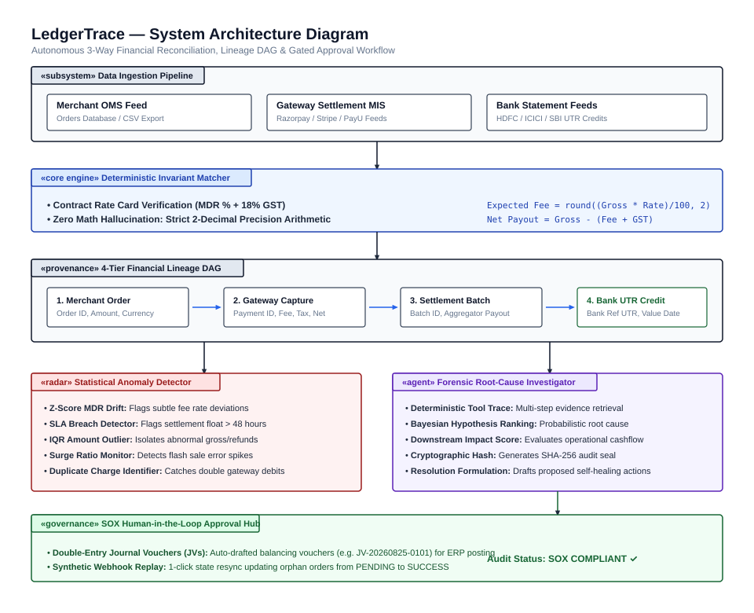

# LedgerTrace

> **Autonomous 3-Way Financial Reconciliation, Anomaly Detection, and Lineage Platform**  
> *Engineered for Payment Aggregators, Fintech Infrastructure, and High-Volume Merchants.*

[](https://ledger-trace-seven.vercel.app/)
[]()
[]()
[]()
[]()

🚀 **Live Interactive Demo:** [https://ledger-trace-seven.vercel.app](https://ledger-trace-seven.vercel.app)

---

## 1. Problem Overview

For high-growth merchants and payment aggregators processing millions of rupees daily, multi-party reconciliation between **Internal Order Databases (OMS)**, **Gateway Settlement MIS (Razorpay/Aggregators)**, and **Bank Statement Feeds (UTR Credits)** is a massive operational vulnerability:

1. **Net vs. Gross Settlement Splits:** Gateways deposit consolidated lump-sums (e.g. INR 4,82,340) covering thousands of orders after deducting dynamic processing fees, 18% GST, rolling risk reserves, and dispute adjustments.
2. **Silent MDR Fee Surcharges:** Aggregators occasionally apply non-standard surcharge rates (e.g. charging 3.2% or 2.5% on premium credit cards against a 1.8% contracted rate card) without prior alerts, creating silent, compounding revenue leakage.
3. **Dropped Webhooks & Orphan Payments:** Network drops (HTTP 504 gateway timeouts) or customer tab closures leave internal order databases in `PENDING` state while customer funds have already been captured by the gateway and settled to the bank account.
4. **Settlement SLA Delays (T+1 / T+2 Breaches):** Floating funds delayed beyond the 48-hour SLA expose finance operations to severe liquidity crunches and overdraft risks on vendor payouts.

**LedgerTrace** solves this through a hybrid architecture combining **deterministic mathematical invariants** (zero floating-point math hallucinations) with **autonomous forensic agents** and **SOX-compliant human-in-the-loop approval workflows**.

---

## 2. Platform Architecture

<p align="center">
  
</p>

---

## 3. Core AI & Financial Engineering Capabilities

### 3.1 Deterministic Mathematical Invariants (Zero Math Hallucination)
Financial numbers are never estimated by LLMs. All fee calculations and tax derivations run through deterministic decimal rules:
$$\text{Expected Fee} = \text{round}\left(\frac{\text{Gross Amount} \times \text{Contracted Rate}}{100}, 2\right)$$
$$\text{Expected GST} = \text{round}(\text{Expected Fee} \times 0.18, 2)$$
$$\text{Expected Net Payout} = \text{Gross Amount} - (\text{Expected Fee} + \text{Expected GST})$$

### 3.2 Autonomous Forensic Investigator with Reasoning Chains
When an anomaly is flagged, the agent executes an auditable tool trace:
* `check_contracted_rate_card(payment_method)`
* `calculate_fee_delta(gross, actual_fee, expected_fee)`
* `evaluate_delivery_logs(order_id)`
* `check_settlement_sla(captured_at, settled_at)`
* Evaluates competing hypotheses (e.g. *Aggregator card surcharge* vs *Contract amendment lag* vs *Network timeout*), computes Bayesian probabilities, and generates an immutable SHA-256 audit hash.

### 3.3 SOX-Compliant Human-in-the-Loop Approval Hub
High-risk financial interventions are staged for controller review before execution:
* **Double-Entry Journal Vouchers (JVs):** Auto-drafted balancing debit/credit vouchers (e.g. `JV-20260825-0101`) ready for ERP systems (SAP, NetSuite, Tally).
* **Synthetic Webhook Replays:** 1-click state resync converting orphan orders from `PENDING` to `SUCCESS`.
* **Dispute Dossiers:** Pre-compiled evidence packets (e.g. `DISP-8C19`) formatted for gateway operations desks.

### 3.4 5-Algorithm Statistical Anomaly Radar
1. **Z-Score Fee Drift:** Identifies subtle micro-overcharges deviating from historical baselines ($Z > 2.0$).
2. **Settlement Velocity SLA Breach:** Flags captured funds floating beyond the 48-hour threshold.
3. **IQR Amount Outlier Detection:** Flags statistically irregular refund or gross amounts.
4. **Surge Discrepancy Ratio:** Detects error spikes during high-concurrency flash sales.
5. **Duplicate Gateway Charge Identifier:** Catches double-charges on identical merchant orders.

### 3.5 Natural Language Conversational Intelligence
Deterministic NLP entity extraction and intent routing that runs locally with zero external API dependencies:
* *"Total fee leakage this batch"* $\rightarrow$ Aggregates unauthorized MDR surcharges.
* *"Show all overcharges above 500"* $\rightarrow$ Filters high-impact transaction anomalies.
* *"Compare 3-way totals"* $\rightarrow$ Produces a 3-way balance provenance audit across Merchant, Gateway, and Bank feeds.

---

## 4. Failure Modes & Engineering Solutions (War Stories)

| Real-World Failure Mode | Root Cause | LedgerTrace Automated Resolution |
| :--- | :--- | :--- |
| **MDR Fee Rate Drift** | Aggregator applied 3.2% surcharge on Amex card vs 1.8% contracted rate. | Agent calculates INR 1,190 delta, stages adjusting Journal Voucher `JV-20260825-0101`, and drafts formal dispute dossier `DISP-MDR-0101`. |
| **Dropped Webhook (Orphan Order)** | Merchant server returned HTTP 504 during flash sale surge while gateway captured funds. | Agent traces delivery logs, verifies gateway capture `pay_fs_03`, and executes a 1-click synthetic webhook replay to mark order `SUCCESS`. |
| **Settlement SLA Delay** | Clearing bank placed rolling risk reserve hold on transaction > 72 hours. | Agent flags T+2 breach, isolates floating capital, and posts suspense hold entry to protect scheduled vendor disbursements. |
| **Floating-Point Rounding Drift** | Aggregator vs merchant database rounding discrepancies on paise fractions. | Mathematical invariant engine bounds all fee calculations to IEEE 754 decimal precision with strict 2-decimal rounding. |

---

## 5. Project Structure

```
LedgerTrace/
|-- backend/
|   |-- app/
|   |   |-- engine/
|   |   |   |-- calculators.py          # Strict MDR and 18% GST mathematical validators
|   |   |   |-- ingester.py             # 3-way CSV feed parser and normalizer
|   |   |   |-- matcher.py              # Deterministic 3-way reconciliation engine
|   |   |   |-- lineage_builder.py      # Constructs 4-tier financial DAG
|   |   |   |-- continuous_engine.py    # Streaming continuous reconciliation engine
|   |   |   |-- anomaly_detector.py     # 5-algorithm statistical anomaly radar
|   |   |-- agents/
|   |   |   |-- reasoning.py            # Multi-step forensic reasoning chain & Bayesian scoring
|   |   |   |-- investigator.py         # Autonomous discrepancy investigation controller
|   |   |   |-- tools.py                # Deterministic agent tools (rate cards, logs, SLAs)
|   |   |   |-- approval.py             # Human-in-the-loop staged action queue & audit ledger
|   |   |   |-- query_engine.py         # Deterministic NLP financial query engine
|   |   |   |-- healing.py              # Self-healing actions (JVs, webhook replays, disputes)
|   |   |   |-- controller.py           # Orchestration coordinator & scenario manager
|   |   |-- data/
|   |   |   |-- contracts.json          # Contracted payment method rate cards
|   |   |-- main.py                     # FastAPI REST & SSE streaming server
|   |-- tests/
|   |   |-- test_engine.py              # 39 automated unit tests (100% passing)
|   |-- requirements.txt
|   |-- run.py
|
|-- frontend/
|   |-- src/
|   |   |-- components/
|   |   |   |-- Header.jsx              # Executive topbar with status & search
|   |   |   |-- Sidebar.jsx             # Dark-slate navigation, Risk Radar, Rate Card
|   |   |   |-- SummaryCards.jsx        # 4-card metric strip & scenario preset switcher
|   |   |   |-- CloseCockpit.jsx        # Continuous zero-day close progress meter
|   |   |   |-- NLSearchBar.jsx         # Conversational financial intelligence bar
|   |   |   |-- DiscrepancyTable.jsx    # Filterable discrepancy queue & anomaly radar
|   |   |   |-- AgentDrawer.jsx         # Slide-over forensic investigation drawer
|   |   |   |-- ApprovalHub.jsx         # Gated controller approval queue (Approve/Reject)
|   |   |   |-- LineageGraph.jsx        # 4-tier visual financial DAG topology
|   |   |   |-- ActionCenter.jsx        # Cryptographic audit ledger & JV registry
|   |   |   |-- CommandPalette.jsx      # Ctrl+K global transaction search
|   |   |   |-- UploadModal.jsx         # Custom 3-way CSV feed ingestion modal
|   |   |-- services/
|   |   |   |-- api.js                  # Axios client for backend REST API
|   |   |   |-- mockData.js             # High-fidelity offline fallback dataset
|   |   |-- App.jsx
|   |-- package.json
|   |-- vite.config.js
|
|-- docs/
|   |-- DEMO_SCRIPT.md                  # 5-minute video pitch & presentation guide
|-- memory.md                           # Comprehensive architectural memory & spec
|-- LICENSE                             # MIT License
|-- README.md
```

---

## 6. Quickstart Guide

### Prerequisites
* Python 3.10+
* Node.js 18+ and npm

### 1. Start the Backend API
```bash
cd backend
python -m venv venv
.\venv\Scripts\activate      # On Linux/macOS: source venv/bin/activate
pip install -r requirements.txt
python run.py
```
* **API URL:** `http://127.0.0.1:8000`
* **Swagger Interactive Docs:** `http://127.0.0.1:8000/docs`

### 2. Start the Frontend Dashboard
```bash
cd frontend
npm install
npm run dev
```
* **Dashboard URL:** `http://localhost:5173`

### 3. Run Automated Unit Tests (39 Tests)
```bash
cd backend
.\venv\Scripts\python.exe -m unittest discover -s tests -v
```
Output:
```
Ran 39 tests in 0.008s
OK
```

---

## 7. License

MIT License. Copyright (c) 2026 sm-daniyal.
