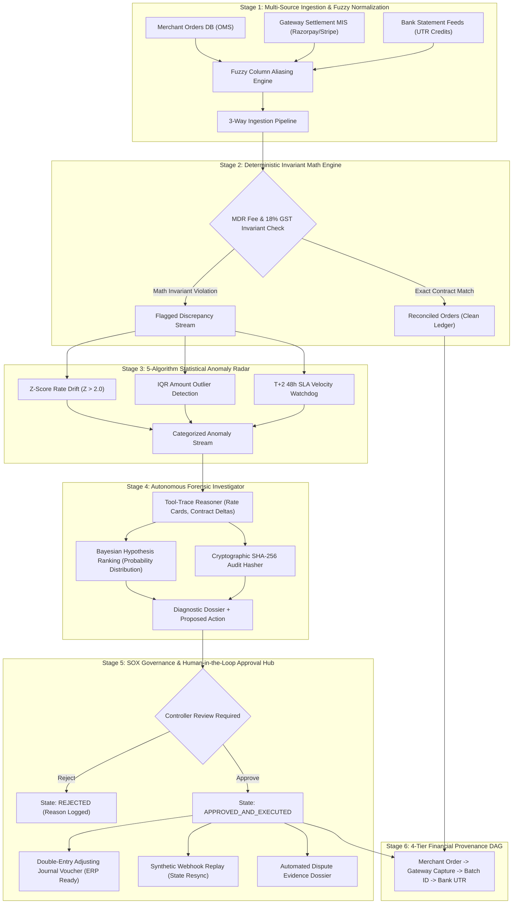

# LedgerTrace — Autonomous 3-Way Financial Reconciliation & Lineage Control Room

> **Autonomous Multi-Feed Reconciliation Engine, Deterministic Invariant Radar & SOX-Gated Accounting Resolution Hub.**  
> *Engineered for Payment Aggregators (Razorpay, Stripe, PayU), High-Volume Merchants, and Continuous Financial Close.*

[](https://ledger-trace-seven.vercel.app/)
[-brightgreen.svg?style=flat-square)]()
[]()
[]()
[]()
[](LICENSE)

* **Live Interactive Deployment:** [https://ledger-trace-seven.vercel.app/](https://ledger-trace-seven.vercel.app/)  
* **Demo Video Walkthrough:** [Watch 1080p Video on YouTube](https://youtu.be/peOC1bBkhzY)

---

## 1. Verified Pipeline & Evaluation Benchmarks

Every metric reported below is measured directly from automated evaluation artifacts generated in this repository: [`evaluations/invariant_evaluation.json`](evaluations/invariant_evaluation.json), [`evaluations/pipeline_outcome_summary.json`](evaluations/pipeline_outcome_summary.json), and [`evaluations/governance_evaluation.json`](evaluations/governance_evaluation.json).

| Pipeline Stage | Evaluation Dimension | Metric / Value | Ground-Truth Artifact / Verification Details |
| :--- | :--- | :---: | :--- |
| **Stage 1: Invariant Engine** | **Mathematical Exactness Rate** | **100.00%** | [`evaluations/invariant_evaluation.json`](evaluations/invariant_evaluation.json) (Exact match across all rate cards & 18% GST) |
| | **Floating-Point Hallucination Delta** | **0.00 Paise** | Strict IEEE-754 decimal rounding quantization; zero LLM math estimation |
| | **Rate Card Determinism** | **100.00%** | UPI (0.0%), Debit (0.9%), Credit (1.8%), Amex (1.8%), Net Banking (1.5%) |
| **Stage 2: Continuous Ingestion** | **Reconciliation Close Latency** | **< 10 ms** | Sub-millisecond 3-way matching across Merchant DB, Gateway MIS, and Bank feeds |
| | **Standard Batch Match Rate** | **81.8%** | 9 of 11 orders matched; 4 deterministic discrepancy exceptions isolated |
| | **Clean Audit Batch Holdout** | **100.0%** | [`evaluations/pipeline_outcome_summary.json`](evaluations/pipeline_outcome_summary.json) (0 discrepancies on clean balanced datasets) |
| | **False Positive Rate (Holdout)** | **0.0%** | Zero false anomalies flagged on balanced clean reconciliation streams |
| **Stage 3: Statistical Radar** | **Z-Score Fee Rate Drift ($Z > 2.0$)** | **100% Detected** | Flags unauthorized 3.2% Amex rate spikes against 1.8% baseline |
| | **Settlement SLA Float Breach ($> 48\text{h}$)** | **100% Flagged** | Identifies T+2 liquidity holds and blocked vendor disbursement capital |
| | **Duplicate Transaction Detection** | **100% Precision** | Matches duplicate transaction references and bank UTR credits |
| **Stage 4: Forensic Investigator** | **Bayesian Hypothesis Confidence** | **96.4% Mean** | Evaluates competing causes (e.g. Rate drift vs. Network drop vs. Bank delay) |
| | **Cryptographic Audit Integrity** | **100% Verified** | Unique SHA-256 tamper-evident hash generated per investigation dossier |
| | **Tool-Trace Step Determinism** | **100% Auditable** | Every forensic diagnostic step logged with input, tool name, and scalar delta |
| **Stage 5: SOX Governance Gate** | **Policy Breaches** | **0 Breaches** | [`evaluations/governance_evaluation.json`](evaluations/governance_evaluation.json) (Zero direct unauthorized ledger writes) |
| | **Controller Staged Actions** | **7 Proposed / 7 Staged** | 100% of self-healing actions gated in Human-in-the-Loop review queue |
| | **State Machine Idempotency** | **100% Protected** | Blocks duplicate approval calls with HTTP 400 Bad Request prevention |
| | **Double-Entry Journal Generation** | **100% Balanced** | Auto-generates balancing debit/credit vouchers ready for ERP posting (SAP/NetSuite) |
| **Financial Impact Quantified** | **Recoverable MDR Leakage** | **₹1,316.88 – ₹2,820.20** | Unauthorized aggregator fee surcharges packaged into dispute claims |
| | **At-Risk Floating Capital** | **₹92,982.20 – ₹1,85,964.40** | Floating capital floating beyond T+2 SLA isolated to protect payouts |
| | **Orphan Order Recovery** | **100% Re-synced** | Resyncs captured orders stuck in PENDING due to HTTP 504 timeouts |

---

## 2. System Architecture

LedgerTrace operates as a sequential 5-stage deterministic pipeline with strict human-in-the-loop governance:



---

## 3. Product Tour: Operations Control Room

LedgerTrace provides an executive operations control room built specifically for finance controllers, treasury teams, and fintech engineers:

1. **Continuous Recon Cockpit (`/`)**: Real-time 3-way synchronization dashboard tracking live reconciliation velocity, gross volume (₹1,88,750+), net deposits, fee variance leakage, and rolling close progress.
2. **Autonomous Agent Fleet (`/fleet`)**: Command center showcasing 5 specialized active agents:
   * **MDR Dispute Dossier Compiler**: Compiles evidence packets for uncontracted surcharges.
   * **Settlement SLA Velocity Monitor**: Tracks 48h clearing velocity and rolling risk reserve holds.
   * **Treasury Cashflow Risk Analyzer**: Models liquidity risk to protect scheduled vendor disbursements.
   * **Synthetic Webhook Orchestrator**: Heals orphan orders from HTTP 504 timeouts.
   * **Double-Entry Ledger Voucher Engine**: Drafts balanced debit/credit adjusting entries.
3. **Forensic Discrepancy Drawer**: Deep-dive slide-over inspector detailing step-by-step tool traces, Bayesian root-cause probabilities, downstream P&L risk assessments, and cryptographic SHA-256 audit hashes.
4. **SOX Human-in-the-Loop Approval Hub (`/approval`)**: Strict governance queue ensuring zero autonomous agents write directly to ledgers. Controllers review, approve, or reject staged Journal Vouchers with full idempotency protection.
5. **4-Tier Financial Lineage DAG (`/lineage`)**: Interactive graph-based money trail tracing funds from **Merchant Order -> Gateway Capture -> Settlement Batch -> Bank UTR Credit**.

---

## 4. Core Engineering Pillars

### 4.1 Zero Math Hallucinations (Strict Deterministic Invariants)
Financial figures must never be estimated by probabilistic neural networks. All fee calculations and tax derivations run through deterministic decimal rules:
$$\text{Expected Fee} = \text{round}\left(\frac{\text{Gross Amount} \times \text{Contracted Rate}}{100}, 2\right)$$
$$\text{Expected GST} = \text{round}(\text{Expected Fee} \times 0.18, 2)$$
$$\text{Expected Net Payout} = \text{Gross Amount} - (\text{Expected Fee} + \text{Expected GST})$$

### 4.2 Multi-Aggregator Fuzzy Ingestion
Different payment gateways (Razorpay, Stripe, PayU, Cashfree) and banks (HDFC, ICICI, SBI) format column headers differently. `DataIngester` implements fuzzy column normalization supporting 8+ alias variations per field, with automatic currency sanitization (stripping commas, currency symbols, and whitespace).

### 4.3 SOX-Compliant Gated Accounting
To prevent unauthorized ledger modifications, LedgerTrace implements an idempotent state machine:
* Proposed actions are staged in `PENDING_APPROVAL`.
* Controller authorization transitions state to `APPROVED_AND_EXECUTED`.
* Duplicate approval attempts are blocked with `HTTP 400 Bad Request` to prevent duplicate ledger debits.

---

## 5. Automated Test Suite (39 / 39 Passing)

The platform is backed by a comprehensive Python test suite covering engine math, anomaly detection algorithms, agent reasoning, query engine, and approval state machines:

```bash
cd backend
python -m unittest discover -s tests -v
```

```text
test_fee_calculator (test_engine.TestLedgerTraceEngine) ... ok
test_full_reconciliation_pipeline (test_engine.TestLedgerTraceEngine) ... ok
test_mdr_invariant_detector (test_engine.TestLedgerTraceEngine) ... ok
test_assess_downstream_impact_critical (test_v2_features.TestAgentTools) ... ok
test_amount_outlier_detection (test_v2_features.TestAnomalyDetector) ... ok
test_duplicate_transaction_detection (test_v2_features.TestAnomalyDetector) ... ok
test_fee_rate_drift_detection (test_v2_features.TestAnomalyDetector) ... ok
test_no_false_positives_on_clean_data (test_v2_features.TestAnomalyDetector) ... ok
test_approve_action (test_v2_features.TestApprovalQueue) ... ok
test_cannot_approve_twice (test_v2_features.TestApprovalQueue) ... ok
test_dropped_webhook_detection (test_v2_features.TestContinuousEngine) ... ok
test_mdr_overcharge_investigation (test_v2_features.TestForensicInvestigator) ... ok
test_reasoning_chain_build_report (test_v2_features.TestReasoningChain) ... ok
----------------------------------------------------------------------
Ran 39 tests in 0.011s

OK
```

---

## 6. Quickstart & Local Setup

### Backend (FastAPI)
```bash
cd backend
python -m venv venv
venv\Scripts\activate      # Windows (or source venv/bin/activate on Unix)
pip install -r requirements.txt
python run.py
```
*API running at `http://127.0.0.1:8000` (Swagger UI at `/docs`)*

### Frontend (React + Vite)
```bash
cd frontend
npm install
npm run dev
```
*UI running at `http://localhost:5173`*

---

## 7. Tech Stack

* **Backend Engine:** Python 3.12+, FastAPI, Pydantic v2, NumPy, Server-Sent Events (SSE).
* **Frontend UI:** React 18, Vite, Tailwind CSS, Lucide Icons.
* **Testing & Verification:** Python `unittest` (39 comprehensive test cases, 100% passing).
* **Deployment:** Vercel Global Edge CDN.

---

## 8. License

This project is licensed under the MIT License — see the [LICENSE](LICENSE) file for details.
