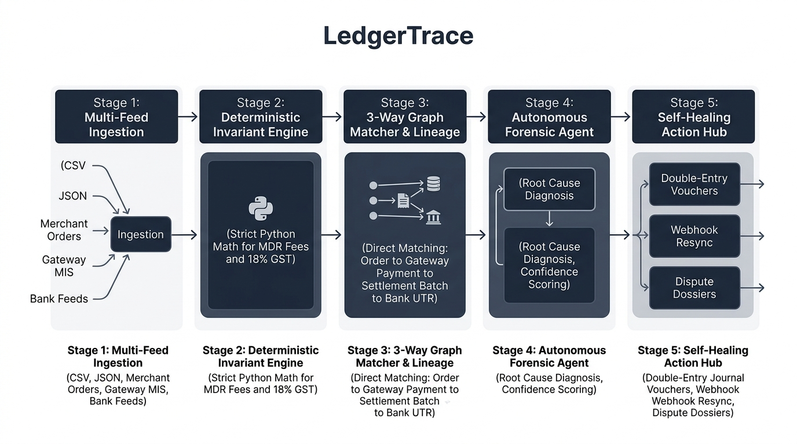

# LedgerTrace

Autonomous 3-Way Financial Reconciliation and Transaction Lineage Platform.

LedgerTrace is an AI-native financial controller and reconciliation platform engineered for payment aggregators, fintech infrastructure providers, and high-volume digital merchants. It unifies internal merchant order databases, payment gateway settlement reports (e.g. Razorpay MIS), and bank statement feeds into an active financial lineage graph with autonomous discrepancy resolution.

---

## 1. The Core Problem in Modern Fintech

When high-growth digital businesses scale, financial reconciliation across multi-party payment rails becomes a critical operational vulnerability:

1. **Net vs. Gross Settlement Splits:** Payment gateways deposit single lump-sum credits (e.g., INR 4,82,340) covering hundreds of individual orders after deducting variable processing fees, 18% GST, chargeback penalties, and rolling reserves.
2. **Hidden MDR Fee Leakage:** Aggregators occasionally apply non-standard surcharge rates (e.g., charging 2.5% on premium cards against a 1.8% contracted rate) without prior notification, causing substantial undetected revenue loss.
3. **Dropped Webhooks (Orphan Transactions):** Network timeouts (HTTP 504) or premature browser tab closures leave merchant databases in a PENDING state even after funds have been successfully captured by the gateway and credited to the bank.
4. **Settlement SLA Delays (T+1 / T+2):** Floating funds delayed beyond the 48-hour settlement window expose merchants to cash-flow bottlenecks and overdraft risks on scheduled vendor disbursements.

---

## 2. System Architecture & Solution Design

LedgerTrace addresses these bottlenecks through a hybrid architecture combining **deterministic mathematical invariant calculators** (ensuring zero floating-point math hallucinations) with **autonomous forensic agents** for root-cause diagnosis and self-healing.



---

## 3. Key Capabilities

### 3.1 Deterministic Invariant Mathematics
All financial calculations adhere strictly to formulaic bounds:
* `Expected Processing Fee = round((Gross Amount * Contracted Rate) / 100, 2)`
* `Expected GST (18%) = round(Expected Processing Fee * 0.18, 2)`
* `Expected Net Payout = round(Gross Amount - (Expected Fee + Expected GST), 2)`

### 3.2 4-Tier Financial Lineage Graph (DAG)
Traces the visual end-to-end journey of every rupee across four sequential stages:
1. **Merchant Orders:** What was recorded in the internal store database.
2. **Gateway Captures:** What the aggregator captured (Gross, Fee, GST, Net).
3. **Settlement Batches:** Grouped payout batches.
4. **Bank UTR Credits:** The final verified cash deposit credited to the bank account.

### 3.3 Autonomous Forensic Investigation
When an anomaly is flagged, the agent executes an automated reasoning trace:
* Traverses rate cards and API logs.
* Measures exact fee delta and calculates downstream operational risk.
* Assigns a confidence score and generates an auditable reasoning chain.

### 3.4 1-Click Self-Healing Resolution
* **Double-Entry Journal Voucher (JV):** Generates compliant debit/credit balancing entries (e.g. `JV-20260821-8C19`) ready for ERP systems (SAP, NetSuite, Tally).
* **Synthetic Webhook Replay:** Automatically resyncs orphan transactions from `PENDING` to `SUCCESS`.
* **Formal Dispute Dossier:** Compiles evidence claim packets (e.g. `DISP-8C19`) for gateway operations desks.

---

## 4. Core Discrepancy Scenarios Handled

| Discrepancy Type | Root Cause Identified | Automated Self-Healing Action |
| :--- | :--- | :--- |
| **MDR Fee Overcharge** | Aggregator applied 2.5% surcharge on card vs 1.8% contracted rate card. | Auto-posts balancing journal entry and drafts formal dispute claim. |
| **Dropped Webhook (Orphan)** | HTTP 504 gateway timeout on merchant webhook endpoint during capture. | Executes synthetic webhook replay to update merchant state to SUCCESS. |
| **Settlement SLA Delay** | Captured transaction exceeded 48h settlement window without payout batch ID. | Flags downstream vendor disbursement risk and posts suspense hold. |
| **Missing Gateway Record** | Customer abandoned checkout or network failed before payment initiation. | Flags record for checkout abandonment recovery. |

---

## 5. Project Directory Structure

```
LedgerTrace/
|-- assets/
|   |-- architecture_diagram.png     # Visual system architecture diagram
|-- backend/
|   |-- app/
|   |   |-- engine/
|   |   |   |-- calculators.py       # Strict MDR and GST mathematical validators
|   |   |   |-- ingester.py          # Multi-format CSV parser and normalizer
|   |   |   |-- matcher.py           # Deterministic 3-way reconciliation engine
|   |   |   |-- lineage_builder.py   # Constructs 4-tier financial DAG
|   |   |-- agents/
|   |   |   |-- investigator.py      # Autonomous forensic root-cause investigator
|   |   |   |-- healing.py           # Self-healing actions (journals, webhooks, disputes)
|   |   |   |-- tools.py             # Deterministic agent tooling
|   |   |   |-- controller.py        # Pipeline coordinator and scenario generator
|   |   |-- data/
|   |   |   |-- sample_merchant_orders.csv
|   |   |   |-- sample_gateway_settlement.csv
|   |   |   |-- sample_bank_feed.csv
|   |   |   |-- contracts.json       # Merchant fee contract rate cards
|   |   |-- main.py                  # FastAPI server with REST endpoints
|   |-- tests/
|   |   |-- test_engine.py           # Automated unit test suite
|   |-- requirements.txt
|   |-- run.py
|
|-- frontend/
|   |-- src/
|   |   |-- components/
|   |   |   |-- Sidebar.jsx          # Left-hand system sidebar
|   |   |   |-- Header.jsx           # Topbar with status and search
|   |   |   |-- SummaryCards.jsx     # 01 Input KPI cards and preset selector
|   |   |   |-- LineageGraph.jsx     # 02 Pathways financial lineage topology
|   |   |   |-- DiscrepancyTable.jsx # 03 Forensic discrepancy queue
|   |   |   |-- AgentDrawer.jsx      # Slide-over investigation inspector
|   |   |   |-- ActionCenter.jsx     # 04 Executed actions audit log
|   |   |   |-- CommandPalette.jsx   # Ctrl+K global transaction search
|   |   |   |-- UploadModal.jsx      # Custom CSV import modal
|   |   |-- App.jsx
|   |-- package.json
|   |-- vite.config.js
|
|-- README.md                        # Project documentation
|-- run_dev.bat                      # 1-click Windows startup launcher
```

---

## 6. Local Quickstart Guide

### Prerequisites
* Python 3.10 or higher
* Node.js 18 or higher and npm

### Option A: 1-Click Startup (Windows)
Double-click `run_dev.bat` from the root directory.

### Option B: Manual Setup

#### Step 1: Start Backend
```bash
cd backend
python -m venv venv
.\venv\Scripts\activate      # On Linux/macOS: source venv/bin/activate
pip install -r requirements.txt
python run.py
```
* Backend API: `http://127.0.0.1:8000`
* Swagger Interactive Docs: `http://127.0.0.1:8000/docs`

#### Step 2: Start Frontend
```bash
cd frontend
npm install
npm run dev
```
* Open your browser at `http://localhost:5173`

#### Step 3: Run Automated Tests
```bash
cd backend
.\venv\Scripts\python.exe -m unittest discover -s tests
```

---

## 7. Interactive Feature Guide

1. **Select Scenario Preset:** Choose between *Standard Production Batch*, *Flash Sale Surge*, or *Month-End Audit (Clean)*.
2. **Execute Reconciliation:** Click **RUN RECONCILIATION REPORT** to view live multi-stage scanning progress.
3. **Inspect Lineage:** Click any node in Section 02 to view its provenance across all 4 stages.
4. **Investigate & Resolve:** Click **INVESTIGATE** on any anomaly row to inspect the forensic agent trace and execute 1-click self-healing actions.
5. **Quick Search:** Press **Ctrl+K** anywhere in the app to search transactions by Order ID, Gateway ID, or Bank UTR.

---

## 8. License
MIT License. Copyright (c) 2026 LedgerTrace Project.
